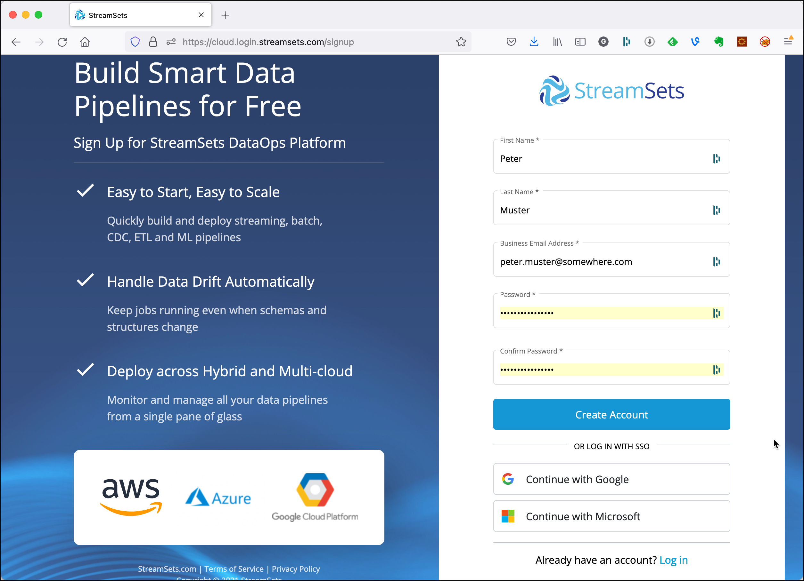
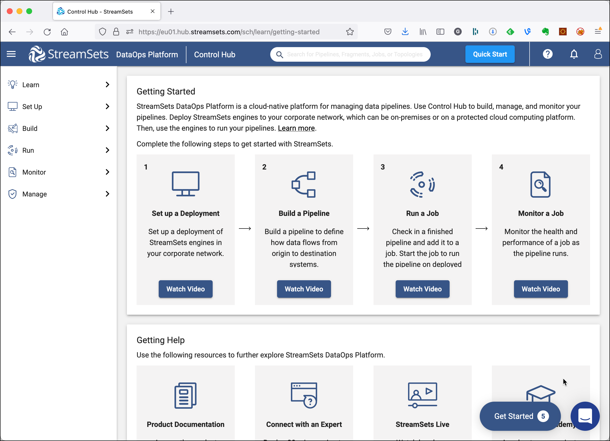
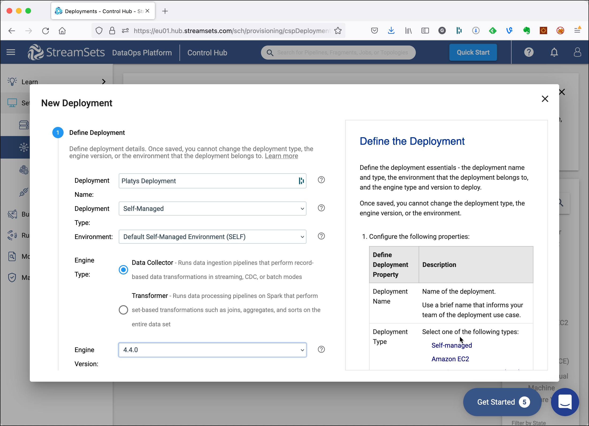
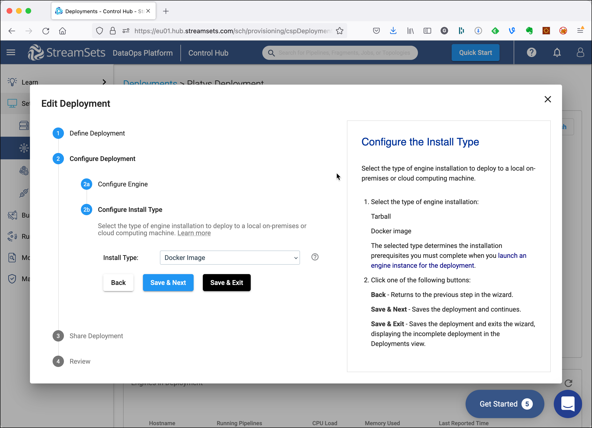
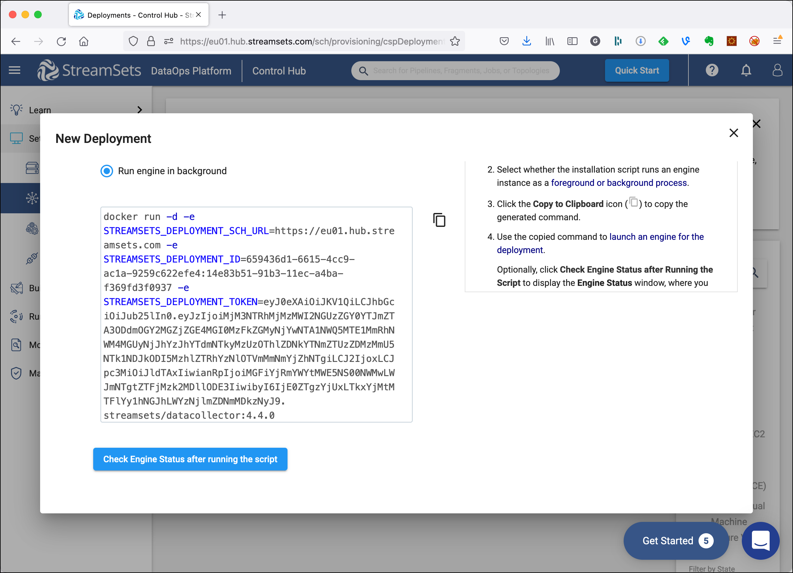

# Creating a self-managed Environment using Platys

This recipe will show how to create a self-managed environment for the [StreamSets DataOps Platform](https://streamsets.com/products/dataops-platform/). 

## Signup for StreamSets DataPlatform 

Navigate to <https://cloud.login.streamsets.com/signup> and create an account as shown in the diagram. 



Click on **Create Account**. Verify the account using the link in the email you should have received on the emial provided. 

Now login to the newly created account and fill in the account details and click on **Agree & Continue**


and you will get to the StreamSets DataOps homepage



## Create a StreamSets Data Collector engine

In the navigator to the left, click on **Set Up** and navigate to the **Environments** item. You should see a default Self-Managed environment **Default Self-Managed Environment**. We will use this and next create a deployment. 

Navigate to **Deployments** and click on the **Create deployment** link in the main canvas.



Scroll down and click on **Save & Next** and again **Save & Next**. Chose `Docker Image` for the **Install Type**. 



Click on **Save & Next** and again **Save & Next** and the **Start & Generate Install Script** and you should see the script to start the docker container.


Leave the screen open, we will need the environment variables when configuring the service in `platys`.

```
docker run -d -e STREAMSETS_DEPLOYMENT_SCH_URL=https://eu01.hub.streamsets.com -e STREAMSETS_DEPLOYMENT_ID=68f53dc7-1aa7-44b8-a8e5-f73ac9da041c:14e83b51-91b3-11ec-a4ba-f369fd3f0937 -e STREAMSETS_DEPLOYMENT_TOKEN=XXXXXX streamsets/datacollector:4.4.0
```

The deployment-token has been replaced, the real value will be much larger.

## Initialise data platform

Now let's [initialise a platys-supported data platform](../documentation/getting-started.md) with the following services enabled

```
platys init --enable-services STREAMSETS_DATAOPS -s trivadis/platys-modern-data-platform -w 1.14.0
```

Either add the value of `STREAMSETS_DEPLOYMENT_ID` and `STREAMSETS_DEPLOYMENT_TOKEN` to the `config.yml`

```
      STREAMSETS_DATAOPS_deployment_id: '68f53dc7-1aa7-44b8-a8e5-f73ac9da041c:14e83b51-91b3-11ec-a4ba-f369fd3f0937'
      STREAMSETS_DATAOPS_deployment_token: 'XXXXXX'
```

or add the environment variables to the environment, for example by using the `.env` file

```
STREAMSETS_DATAOPS_DEPLOYMENT_ID=68f53dc7-1aa7-44b8-a8e5-f73ac9da041c:14e83b51-91b3-11ec-a4ba-f369fd3f0937
STREAMSETS_DATAOPS_DEPLOYMENT_TOKEN=XXXXXX
```

The URL by default is set to `https://eu01.hub.streamsets.com`. If you need another value, then specify it in the `config.yml` file using the property `STREAMSETS_DATAOPS_deployment_sch_url`.

## Check the status in Streamsets DataOps Platform

Click on **Check Engine Status after runing the script**, if you have not done it yet. 


Now generate and start the platform

```bash
export DATAPLATFORM_HOME=${PWD}

platys gen

docker-compose up -d
```

In StreamSets DataOps Platform after a while you should get the following confirmation message.



The engine running in docker has successfully connected to the StreamSets DataOps Platform. Click on **Close**.

The environment is ready to be used.
